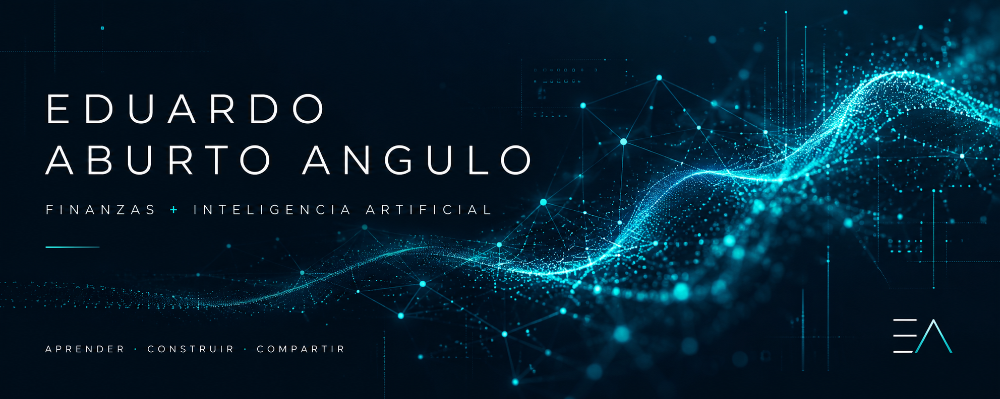

  

# 👋 Hola, soy Eduardo Aburto Angulo

Soy **banquero patrimonial sénior** y me interesa conectar la experiencia financiera con la **inteligencia artificial aplicada** para apoyar decisiones mejor fundamentadas y centradas en el cliente.

Este GitHub es mi espacio para **aprender, construir, experimentar y compartir** proyectos en la intersección de las finanzas, los datos y la tecnología.

`Banca patrimonial` · `Inteligencia artificial` · `Análisis de datos` · `Gestión de proyectos` · `Finanzas`

## 🧠 ¿Qué estoy explorando?

- Inteligencia artificial aplicada a servicios financieros.
- Análisis de datos para apoyar decisiones de inversión.
- Procesamiento de lenguaje natural para interpretar noticias y contexto de mercado.
- Diseño y evaluación de señales para fondos de inversión.
- Gestión de proyectos de IA: viabilidad, riesgos, métricas y adopción.
- Supervisión humana, explicabilidad y uso responsable de la tecnología.

## 🔬 Laboratorio de ideas

Me interesa transformar problemas del negocio en propuestas que se puedan analizar, probar y mejorar. Mi enfoque combina tres preguntas:

1. **¿Qué problema estamos resolviendo para el cliente?**
2. **¿Cómo medimos si la solución aporta valor?**
3. **¿Qué controles necesitamos antes de utilizarla?**

## 💼 Proyecto en desarrollo conceptual

### Motor de señales para fondos de inversión con IA

Una propuesta para identificar cuándo conviene evaluar un cambio de fondo y cuándo es preferible mantener la posición, considerando el perfil del cliente, los costos y el contexto de mercado.

| Componente | Enfoque |
| --- | --- |
| Datos y contexto | Información de fondos, perfil del cliente y noticias de mercado. |
| Motor de señales | Análisis de tendencias y procesamiento de lenguaje natural. |
| Evaluación | Beneficio esperado después de costos y coherencia con el perfil del cliente. |
| Decisión humana | Revisión del asesor, explicación de la señal y aprobación del cliente. |
| Control | Trazabilidad, límites de operación y seguimiento del desempeño. |

**Estado:** propuesta presentada en un pitch de Fase I; este perfil describe el concepto, no un sistema desplegado ni resultados comprobados.

> La tecnología debe apoyar el criterio profesional y poner el beneficio del cliente en el centro.

## 🤝 Conectemos

Me interesa intercambiar ideas sobre **IA aplicada, banca patrimonial, análisis financiero y proyectos tecnológicos con impacto práctico**.

Puedes encontrar mis proyectos y avances aquí: [@eduardoaburtoa](https://github.com/eduardoaburtoa).

---

Portafolio personal. Las ideas aquí compartidas son personales y no representan una postura institucional ni una recomendación de inversión.
